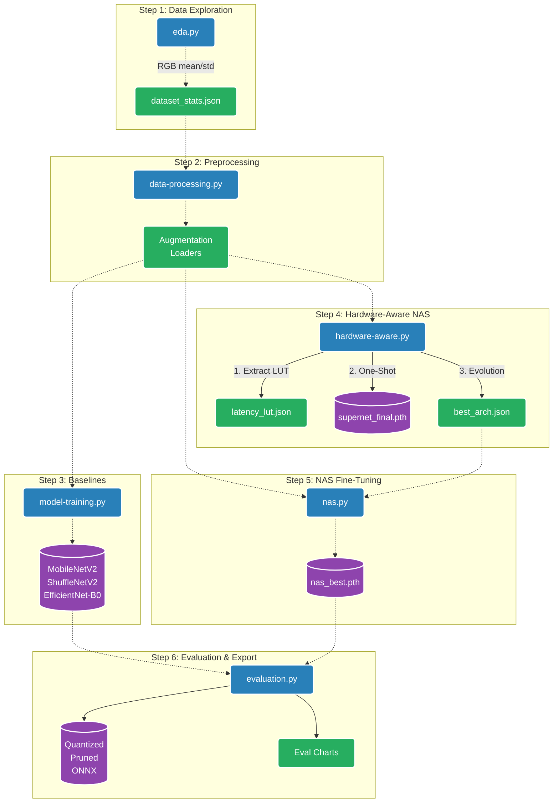

# Hardware-Aware NAS for Edge Devices

This repository contains the complete pipeline for a **Hardware-Aware Neural Architecture Search (NAS)** project on the **Tiny-ImageNet-200** dataset. The goal is to discover and train a highly optimized neural network architecture that maximizes accuracy while strictly adhering to hardware latency constraints for edge devices.

The workflow is divided into a 6-step script execution pipeline covering everything from initial data exploration to evolutionary architecture search, fine-tuning, and post-training optimizations (Quantization and Pruning).

## Project Highlights

- **Hardware-Aware Evolutionary NAS:** Utilizes a One-Shot SuperNet combined with evolutionary search (tournament selection, crossover, mutation) and a pre-computed Latency Lookup Table (LUT) to find Pareto-optimal architectures.
- **Advanced Training Techniques:** Implements Mixup, CutMix, Label Smoothing, Cosine Annealing Learning Rate, and Automatic Mixed Precision (AMP).
- **Performance Optimizations:** Leverages PyTorch `channels_last` memory format, `torch.compile`, and TF32 on Ampere GPUs for maximum training throughput.
- **Post-Training Optimization:** Includes Dynamic INT8 Quantization, L1 Unstructured Magnitude Pruning, and ONNX Runtime benchmarking for edge deployment.

## System Architecture & Workflow Diagram



## The 6-Phase Pipeline

### 1. `eda.py` (Exploratory Data Analysis)
Performs dataset integrity checks on Tiny-ImageNet-200. Verifies class distribution, checks for corrupted images, computes global pixel intensity statistics (mean and std deviations for RGB), and generates exploratory plots.
- **Outputs:** `dataset_stats.json`, EDA plots (class distribution, pixel histograms).

### 2. `data-processing.py` (Data Pipeline & Augmentation)
Defines the standard data augmentation strategy (Random Crop, Horizontal Flip, Color Jitter, Random Grayscale, Random Erasing) and sets up efficient PyTorch DataLoaders. Saves a data manifest to ensure consistent dataset splits across all subsequent scripts.
- **Outputs:** `data_manifest.pkl`, `manifest_summary.json`, `dataloader_benchmark.json`.

### 3. `model-training.py` (Baseline Training)
Trains standard lightweight baseline architectures (MobileNetV2, ShuffleNetV2, EfficientNet-B0) from scratch to serve as reference points. Utilizes Mixup, CutMix, and Cosine Annealing.
- **Outputs:** Best model checkpoints (`{baseline}_best.pth`), training curves, and baseline comparison charts.

### 4. `hardware-aware.py` (SuperNet Training & Evolutionary Search)
The core NAS algorithm. 
1. **LUT Construction:** Builds a latency lookup table (LUT) by benchmarking primitive operations (Depthwise Conv, MBConv, ShuffleBlock, SEBlock) on the target hardware.
2. **One-Shot SuperNet:** Trains a SuperNet where every cell contains all operations in parallel, using uniform path sampling.
3. **Evolutionary Search:** Runs an evolutionary algorithm (using tournament selection, crossover, mutation) guided by the LUT to find the Pareto-optimal architecture that maximizes accuracy while satisfying a strict latency budget (e.g., 10 ms).
- **Outputs:** `latency_lut.json`, `supernet_final.pth`, `best_arch.json`, Pareto front plot.

### 5. `nas.py` (Standalone NAS Fine-Tuning)
Takes the optimal architecture definition (`best_arch.json`), instantiates it as a lean, standalone PyTorch model (removing all SuperNet overhead), and trains it from scratch to convergence using the advanced training recipes (Mixup/CutMix).
- **Outputs:** `nas_best_finetuned.pth`, NAS training curves, NAS final summary.

### 6. `evaluation.py` (Final Optimization & Benchmarking)
Loads all trained baseline and NAS models to perform final benchmarking.
- **Quantization:** Applies Post-Training Dynamic INT8 Quantization.
- **Pruning:** Applies L1 Unstructured Magnitude Pruning (30% sparsity).
- **ONNX Export:** Exports models to ONNX and measures inference latency via ONNXRuntime.
- **Analysis:** Generates comparative bar charts and scatter plots (Accuracy vs Latency, FLOPs vs Latency) to demonstrate the efficacy of the found architecture against the baselines.
- **Outputs:** Quantized and Pruned `.pth` models, `.onnx` models, `final_comparison.json`, comprehensive scatter and bubble charts.

## Usage Execution Flow

To reproduce the entire pipeline, execute the scripts sequentially from the project root:

```bash
# 1. Dataset Analysis
python scripts/eda.py

# 2. Preprocessing & Manifest Creation
python scripts/data-processing.py

# 3. Train Baselines
python scripts/model-training.py

# 4. Search for Optimal Architecture
python scripts/hardware-aware.py

# 5. Fine-Tune the Discovered Architecture
python scripts/nas.py

# 6. Evaluate and Export Models
python scripts/evaluation.py
```

## Requirements
- Python 3.11+
- PyTorch 2.0+ (with CUDA support recommended)
- Torchvision
- ONNX and ONNXRuntime
- Matplotlib, Pillow, NumPy
- Thop (optional, for FLOPs calculation)
